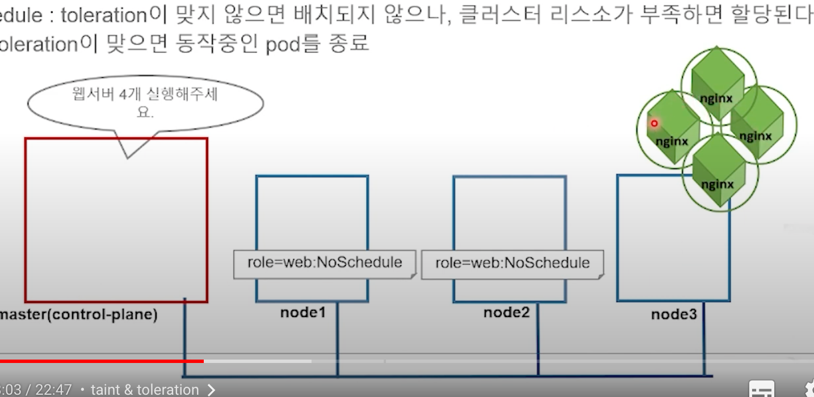

# Pod Scheduling

### Node Selector
1. Worker node에 할당 된 label을 이용해 node를 선택
2. node label 설정
```
kubectl label nodes <NodeName> <LabelName>=<LabelValue>
kubectl label nodes node1.example.com gpu=true
kubectl get nodes -L gpu
```

### Affinity & Anti-Affinity
1. 노드의 특정 집합에만 pod를 스케줄 하도록 지시
2. nodeSelector: selector field에 명시 된 모든 label 이 포함 되어야 배치 됨.
3. nodeAffinity: 특정 노드에만 포드가 실행 되도록 유도
4. nodeAffinity 요구조건
   - 엄격한 요구: requiredDuringSchedulingRequiredDuringExecution
   - 선호도 요구: preferredDuringSchedulingIgnoredDuringExecution
5. nodeAffinity 는 기본적으로 nodeSelector와 기능이 동일
6. 하지만 요구조건에 디테일한 옵션을 걸 수 있음 4번 참조.
```
apiVersion: v1
kind: Pod
metadata:
  name: multipod
spec:
  affinity:
    nodeAffinity:
      requiredDuringSchedulingIgnoredDuringExecution:
        nodeSelectorTerms:
          - matchExpressions:
            - {key: gpu, operator: In, values: [true]}
            - {key: zone, operator: In, values: ["us-west1-a"]}
          - preferredDuringSchedulingIgnoredDuringExecution:
            - weight: 100
              preference:
                matchExpressions:
                  - {key: disktype, operator: In, values: ["ssd]}
```
7. pod scheduling
   - podAffinity: pod를 더 가깝게 배치하기
   - podAntiAffinity: pod를 더 먼 곳에 배치하기

8. podAffinity 요구
   - 엄격한 요구: requiredDuringSchedulingRequiredDuringExecution
   - 선호도 요구: preferredDuringSchedulingIgnoredDuringExecution

9. topologyKey
   - 노드 레이블을 이용해 pod의 affinity와 antiAffinity를 설정할 수 있는 또 하나의 기준
   - 쿠버네티스는 Pod 를 스케줄링 할 때 먼저 pod 의 label 을 기준으로 대상 노드를 찾고, 이후 topologyKey 를 이용해 해당 노드가 원하는 노드인지 확인.

```
kubectl run backend -l app=backend --image=busybox -- sleep 999999
pod/backend created

kubectl get pods --show-labels
NAME       READY   STATUS    RESTARTS   AGE    LABELS
backend    1/1     Running   0          2m     app=backend
```

10. 위와 같은 상황에서 affinity 적용 예제
```
kind: Deployment
metadata:
  name: nginx-deployment
spec:
  replicas: 5
  selector:
    matchLabels:
      app: frontend
  template:
    metadata:
      labels:
        app: frontend
    spec:
      podAffinity:
        requiredDuringSchedulingIgnoredDuringExecution:
          - labelSelector:
              matchLabels:
                app: backend
            topologyKey: kubernetes.io/hostname
      containers:
         ... 생략..
``` 


### Taint & Toleration

1. Pod 스케줄링 기술 방법 중 한가지.
2. 엔진x Pod 설치 요청 시 마스터에 실행 되지 않는 이유는?
3. master 에 toleration 이 적용 되어 있기 때문.

```
kubectl describe nodes master.example.com | grep -i taint

Taints:         node-role.kubernetes.io/master: NoSchedule
```

4. worker node 에 taint 설정 하기.
```
kubectl taint nodes node1.example.com role=web:NoSchedule
kubectl taint nodes node2.example.com role=web:NoSchedule
```
5. 확인 해보기
```
kubectl describe nodes node{1..3}.example.com | grep -i taint

Taints:         role=web:NoSchedule
Taints:         role=web:NoSchedule
Taints:         <none>
```

6. nginx 4개를 실행 하면 node3 에 집중 됨



7. toleration 걸린 노드에 설치를 원할 경우 아래와 같이 toleration 설정 가중 해줌.
```
apiVersion: v1
kind: Pod
metadata:
  name: multipod
spec:
  containers:
  - image: nginx:1.14
    name: nginx-container
    ports:
    - containerPort: 80
  tolerations:
  - key: "role"
    operator: "Equal"
    value: "web"
    effect: "NoSchedule"
```
8. 위와 같이 설정을 바꾸고 실행 하면 Node 1, 2, 3 모두에 설치 가능한 상태가 됨..

### Cordon
1. 노드 스케줄링 중단 (cordon) 및 허용 (uncordon)
2. 특정 노드에 pod 스케줄을 금지하거나 해제
3. kubectl [cordon|uncordon] NODE [options]

```
kubectl cordon node2.example.com

kubectl get nodes

NAME         STATUS                       ROLES                  AGE     VERSION   INTERNAL-IP   EXTERNAL-IP   OS-IMAGE             KERNEL-VERSION    CON
TAINER-RUNTIME                            
k8s-master   Ready                        control-plane,master   7d23h   v1.22.2   10.128.0.3    <none>        Ubuntu 20.04.3 LTS   5.11.0-1018-gcp   doc
ker://20.10.8                             
k8s-node1    Ready, ScheduingDisabled     <none>                 7d22h   v1.22.2   10.128.0.4    <none>        Ubuntu 20.04.3 LTS   5.11.0-1018-gcp   doc
ker://20.10.8                             
k8s-node2    Ready                        <none>                 7d22h   v1.22.2   10.128.0.5    <none>        Ubuntu 20.04.3 LTS   5.11.0-1018-gcp   doc
ker://20.10.8
```

### Drain (노드 비우기)
1. 특정 노드에서 동작중인 모든 Pod 를 제거
2. kubectl drain NODE [options]
3. --ignore-daemonsets     DaemonSet-managed pod 들은 ignore
4. --force=false           RC, RS, Job, DaemonSet 또는 StatefulSet 에서 관리하지 않는 Pod 까지 제거.
```
kubectl apply -f deploy-nginx.yaml
kubectl run db --image=redis
```